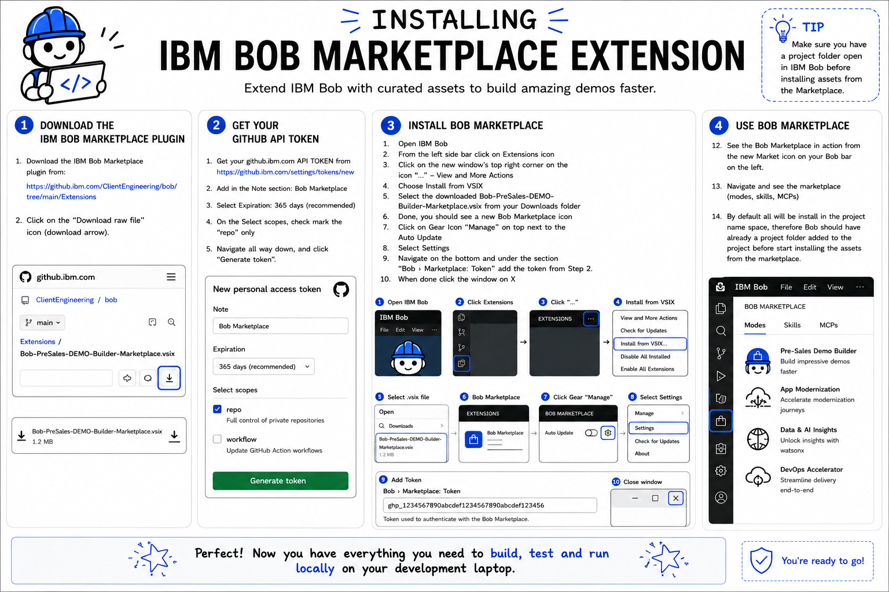

# IBM Bob Marketplace Extension

Extend IBM Bob with curated assets to build demos faster.

---

## Overview

The IBM Bob Marketplace Extension provides a central location for discovering and installing:

- Demo Builder Modes
- Skills
- MCP Servers
- Pre-built assets
- Solution accelerators

All assets are installed directly into your Bob project workspace, enabling faster onboarding and demo development.

---

## Installation Guide

Follow the visual installation guide above or complete the following steps.

### Step 1 – Download the Extension

Download the Marketplace VSIX package:

`Bob-PreSales-DEMO-Builder-Marketplace.vsix`

From:

https://github.ibm.com/ClientEngineering/bob/blob/main/Extensions/Bob-PreSales-DEMO-Builder-Marketplace.vsix

Click the **Download Raw File** icon.

---

### Step 2 – Create a GitHub API Token

Create a GitHub Enterprise token:

https://github.ibm.com/settings/tokens/new

Recommended settings:

| Setting | Value |
|----------|----------|
| Note | Bob Marketplace |
| Expiration | 365 Days |
| Scopes | repo |

Click **Generate Token** and securely save the generated token.

---

### Step 3 – Install the Extension

1. Open IBM Bob
2. Select **Extensions** from the left navigation bar
3. Click **... (View and More Actions)**
4. Select **Install from VSIX**
5. Choose:

   `Bob-PreSales-DEMO-Builder-Marketplace.vsix`

6. Verify the new **Bob Marketplace** icon appears

---

### Step 4 – Configure Marketplace Authentication

1. Click the Marketplace **Manage (Gear)** icon
2. Select **Settings**
3. Navigate to:

   **Bob › Marketplace: Token**

4. Paste your GitHub API token
5. Close the settings window

---

### Step 5 – Explore the Marketplace

Open the new Marketplace icon and browse available assets:

- Modes
- Skills
- MCP Servers

> **Important**
>
> Marketplace assets are installed into the current Bob project.
>
> Before installing any asset, ensure you have opened or created a Bob project workspace.

---

## Validation

Verify the following:

- Bob Marketplace icon is visible
- GitHub API token is configured
- Marketplace catalog loads successfully
- Modes are visible
- Skills are visible
- MCP Servers are visible

---

## Next Steps

After installing the Marketplace, consider installing:

- IBM Pre-Sales Demo Builder Mode
- Carbon MCP
- TechZone MCP
- Additional Skills and Accelerators

---

## Success Criteria

You have successfully completed the installation when:

- Marketplace is accessible from IBM Bob
- Assets can be browsed and installed
- Project-level Modes, Skills, and MCPs can be deployed from the Marketplace

---

Build faster. Deliver more value.
